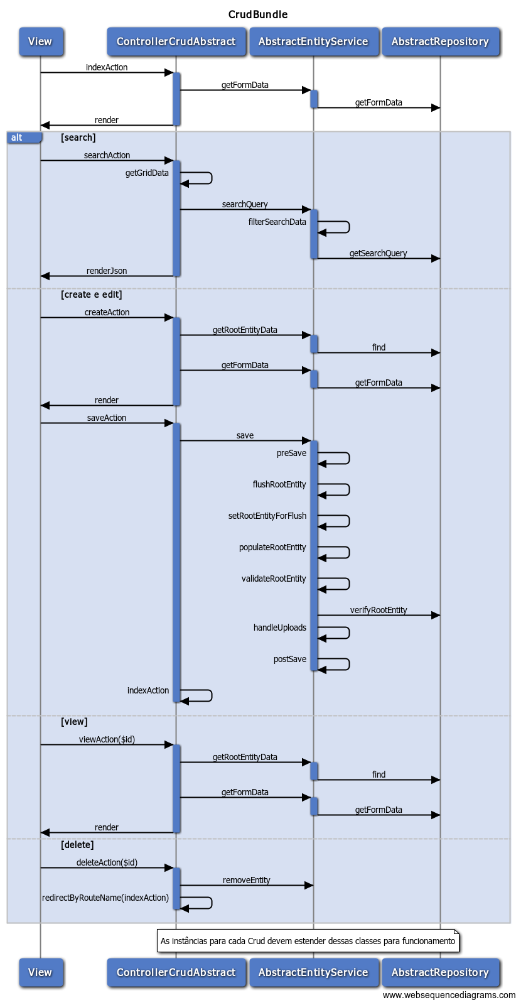

# SANSIS - CRUDBUNDLE

## Conceito

O CrudBundle é um pacote de solução para implantação de CRUDs de maneira padronizada, mas que ao mesmo tempo dá
ao desenvolvedor grande flexibilidade para a implantação dos casos de uso.

Os principais conceitos dentro dele dizem respeito ao encapsulamento das regras de negócio obtido através do uso
da Bizlay, processamento das regras sempre na mesma ordem, a partir do sequenciamento obrigatório na implantado
na AbstractEntityService (pré-save/filtragem dos dados, preenchimento da entidade raiz, validação dos dados,
verificação dos dados, manipulação de arquivos recebidos, validação da entidade de acordo com o banco de dados,
e, por fim, a persistência das entidades, e o pós-persistência - tais como registro de log, disparo de emails, etc).

O uso do Domain Drive Design (DDD) também facilita a implantação das regras de negócio, ao mesmo tempo que agrupa
e padroniza todos os UCs em baixo de uma única linha de comportamento pré-determinado.

## Configuração:

O CrudBundle faz uso de diversos pacotes que possuem sua própria configuração que precisa ser feita no config.yml.

Vide README.md do SanSIS\CoreBundle.

## Design Patterns implantados

### MVC

Embora o próprio Symfony já apresente uma implantação de MVC que é utilizada pela CrudBundle, houve um aprimoramento
no conceito com a secção mais detalhada ao utilizar o BizlayBundle, ViewBundle e CoreBundle.

### Service Layer

Através do uso da Bizlay, a implantação do Crud é feito adicionando-se uma camada exclusiva para regras de negócio.
Desta forma, a Controller volta ao conceito original de Controle de Fluxo da Aplicação e canal de comunicação de
dados da view para a model e vice-versa.

### Domain Drive Design (DDD)

O CrudBundle trabalha com um conceito principal extremamente importante para seu máximo aproveitamento que é o de
desenvolvimento orientado ao domínio (DDD).

Dentro do DDD, encontramos o conceito de Root Entity (Entidade Raiz) que agrega outras entidades dentro ou vinculadas
a ela.

Estas entidades sempre serão utilizadas ou criadas por conta da entidade raiz existir.

Logo, a cada entidade raiz cabe uma funcionalidade de CRUD completa, normalmente.

Por exemplo:

- Cadastro de Bancos
- Cadastro de Agências (que se vinculam a Bancos)
- Cadastro de Contas Bancárias... NÃO!!! Este cadastro só existe vinculado a outro! Qual outro? O do titular da conta.
  Logo, qual seria a entidade raiz correta? A seguir...
- Cadastro de Pessoas (com endereços, telefones, emails e contas bancárias).

### Repository

A repository é um padrão de projeto que visa mediar a interação da camada de negócio com o repositório de dados,
fornecendo sempre uma API que tem como resposta uma ou mais entidades obtidas ou afetadas pela API do reposítório.
Ela dá apoio à camada Service fornecendo um ponto central para os diversos momentos no qual a mesma interage com as
entidades, dando um comportamento padronizado e centralizado à manipulação das mesmas.

Maiores detalhes podem ser obtidos em: http://martinfowler.com/eaaCatalog/repository.html

## Utilização:

O CrudBundle deve ser utilizado preferencialmente através dos geradores disponibilizados no DevelBundle. Porém, é
possível também fazer seu uso manual, caso o DevelBundle não esteja disponível. Neste caso, após as configurações
definidas no CoreBundle terem sido realizadas, é necessário a criação da seguinte estrutura:

- Controller (estendendo de ControllerCrudAbstract)
- Views (uma para cada uma das seguintes actions: index, create, edit e view)
- Model (Modelo do Domínio) que contém:
    - Service (estendendo de AbstractEntityService)
    - Entities (estendendo de AbstractEntity)
    - Repositories (estendendo de AbstractRepository)

### Entities / Entidades

***Consulte a documentação do DevelBundle para ver as opções de reversa disponíveis para banco de dados Oracle.***

As entidades são o elemento principal de qualquer desenvolvimento orientado a domínio, visto que identificam os
elementos do negócio sendo implantado e também suas associações e interações. Logo, o primeiro elemento a ser criado
em qualquer Crud será sempre o modelo das entidades. A forma ideal e mais produtiva de fazê-lo é primeiro definindo
o banco de dados através de alguma ferramenta visual como Data Oracle Modeler ou MySQL Workbench e então realizar uma
reversa do banco de dados. A reversa tem um pequeno impacto pois requer alguma revisão e ajustes nas entidades geradas.
Há desenvolvedores que preferem eliminar a idéia de criar uma reversa do banco de dados para evitar a criação
desnecessária de entidades para tabelas associativas em relacionamentos ManyToMany. Infelizmente, a margem de erro
torna-se muito superior ao da reversa, e o cuidado na manutenção e baixa produtividade tornam a abordagem não
utilizável no contexto da fábrica. Logo, é preferível ajustar os poucos pontos de relacionamentos OneToOne e ManyToMany
manualmente a criar todo um modelo com mais de 300 tabelas e 10.000 atributos manualmente.

Seja qual for o método utilizado para a criação e/ou manutenção das entidades, é importante destacar a importância em
estender suas entidades da classe \SanSIS\BizlayBundle\Entity\AbstractEntity. Ela é a peça fundamental para que todas
as outras camadas possam funcionar de forma coerente, pois encerra diversas pendências da Doctrine, tais como a
conversão das entidades para um formato intercambiável que não seja uma entidade da doctrine.

Um dos conceitos primordiais estabelecidos para uso do Crud, é que um Crud é sempre e apenas de uma única entidade raiz.
Este conceito de entidade raiz diz, de maneira simples, que em um mesmo Crud, outras entidades que venham a ser editadas
ou associadas à raiz estão sempre dentro de uma árvore hierárquica que determina a persistência ou não das mesmas.

Para facilitar a compreensão pense da seguinte forma: tenho as entidades de telefone e pessoa física? Quem será a entidade
raiz? Simples, a pessoa física, pois o cadastro de um telefone só faz sentido se houver alguém associado a ele. Da mesma
forma, endereço, email, etc. Ou seja a estrutura ficaria da seguinte forma:

- PessoaFisica:
    - Telefones
        - Telefone Comercial
        - Telefone Residencial
    - Endereços
        - Domicílio legal
        - Endereço residencial
    - E-mails
        - Pessoal
        - Profissional

Desta forma, uma exclusão de um subitem deveria ser feita indicando na estrutura submetida que aquele item,com
determinado id no banco, está excluído. Em um ambiente onde haja apenas uma tela, o ideal é apenas mudar o nome do
campo oculto "id" para ter o "name" como "idDel". A camada service interpretará isso diretamente e excluirá aquele
registro do banco.

Outro item importante foi a adição é a ativação do Life Cyclle Callback, o que permite a validação automática do
conteúdo da entidade no ato logo antes da inserção no banco de dados. Nos casos em que as entidades estejam sendo
mantidas manualmente, é importante que se adicione a annotation abaixo, e se mantenha o método isValid() herdado.

Na classe:

    @ORM\HasLifecycleCallbacks()

No método isValid:

    @ORM\PreFlush()

Aconselha-se ainda remover esta validação ao subir as entidades para produção, a fim de dar ganho em aplicações com
grande carga de dados ou usuários simultâneos.

### Repositories / Repositórios

Embora a cada entidade corresponda um repositório automático disponibilizado pela Doctrine, é possível também criar
repositórios personalizados. Nestes casos, é mandatório que tais repositórios estendam sempre o repositório abstrato
\SanSIS\BizlayBundle\Repository\AbstractRepository. Isto é importante pois a AbstractRepository apresenta um método
padrão utilizado automaticamente (se não for sobrescrito) para realizar pesquisas na entidade raiz do Crud.

### Controller / Controle

Ao criar uma Controller, ela deverá sempre herdar da \SanSIS\CrudBundle\Controller\ControllerCrudAbstract. A forma mais
simples é identificá-la com o mesmo nome da Entidade que será manipulada, desde que tanto a entidade quanto a Controller
estejam no mesmo Bundle. Caso contrário, deve-se indicar qual Service será utilizada (caso a Service também esteja em
outro Bundle), e na Service deve-se indicar a root entity (entidade raiz).

Deve-se ainda definir a rota de acesso à Controller na annotation da declaração da classe, conforme o novo padrão do
Symfony. Desta forma, as outras rotas definidas na ControllerCrudAbstract serão herdadas e estarão disponíveis
automaticamente. A seguir, um exemplo de como declarar a classe da Controller:

    <?php
    namespace SanSIS\SandboxBundle\Controller;

    use \SanSIS\CrudBundle\Controller\ControllerCrudAbstract;
    use \Sensio\Bundle\FrameworkExtraBundle\Configuration\Route;

    /**
     * @Route("/agencia")
     */
    class AgenciaController extends ControllerCrudAbstract
    {
        ...
    }

A Controller, dentro do CrudBundle, é responsável por fornecer uma forma de acesso padronizada e coerente ao usuário.
Dentro deste conceito, e utilizando apenas annotations, as rotas de acesso disponibilizadas ao usuário são:

- indexAction: rota / - listagem / pesquisa das entidades registradas.
- searchAction: rota /search - realiza a pesquisa e retorna os dados para a view da index.
- createAction: rota /create - apresenta um formulário vazio para criação de entidades, enviando os dados para a saveAction.
- editAction: rota /edit/{id} - apresenta o mesmo formulário preenchido com os dados da entidade escolhifa para edição, e ao final envia os dados para a saveAction.
- saveAction: rota /save - recebe os dados tanto da create quanto da edit e repassa à service para processamento e persistência.

O mecanismo de funcionamento é muito simples e mantém o padrão original do Symfony com as seguintes observações:

- A comunicação entre Controller e Service é feito através do ServiceDto apenas.
- A Service sempre retorna um array ou valor, mas nunca uma entidade.
- Esse retorno é o que a Controller pode repassar à view para uso.
- Nos casos de edit e create, a estrutura do array passado à view sempre será como a seguir:
    - csrf (token para evitar ataques de cross-site).
    - formData (itens utilizados para popular selects, radios, etc).
    - entityData (os dados da entidade em si).
    - indexRoute (rota utilizada no botão cancelar).
    - saveRoute (rota utilizada para salvar os dados).
    - formTitleAction (título colocado automaticamente no formulário - "Criar" ou "Editar", por exemplo).

### Service

Ao criar uma Service para Crud, ela deverá sempre herdar de \SanSIS\CrudBundle\Service\AbstractEntityService.
Uma classe de Service é mapeada e registrada automaticamente através da annotation da jms/di-extra-bundle. Abaixo um
exemplo de como declarar uma service:

    <?php
    namespace SanSIS\SandboxBundle\Service;

    use \SanSIS\BizlayBundle\Service\ServiceDto;
    use \SanSIS\CrudBundle\Service\AbstractEntityService;
    use \JMS\DiExtraBundle\Annotation as DI;

    /**
     * @DI\Service("agencia.service")
     */
    class AgenciaService extends AbstractEntityService
    {
        ...
    }

A camada Service (Bislay, Business Layer ou Camada de Negócios) é a camada principal de implantação de regras de negócio
que o programador utilizará. A Service encapsula todo o modelo de domínio (entidades), sendo a única a lidar com elas
através da EntityManager da Doctrine nos casos onde deve haver persistência dos dados.

Para garantir uma implantação padronizada, a Service segue sempre uma ordem pré-determinada de processamento da informação.
Esta ordem é inicialmente imutável e o objetivo é garantir a melhor performance colocando uma ordem de execução na qual as
tarefas de menor peso são executas em primeiro lugar, e à medida que a informação vai sendo processada, tarefas de maior
complexidade e custo operacional podem ser inseridas.

A forma pela qual se dá isto é através da sobrescrita de alguns métodos declarados na classe AbstractEntityService.
Dentro deste conceito, a ordem de processamento dos métodos da Service que ocorre ao se persistir uma entidade é a seguinte:

- save: **NUNCA SOBRESCREVER** - Chamado pela controller após repassar os dados pela DTO, para processamento da persistência.
    - preSave: *PODE SER SOBRESCRITO* - Utilizado para realizar a filtragem e pré-tratamento dos dados recebidos (retirar máscaras, converter valores, etc).
    - flushRootEntity:  **NUNCA SOBRESCREVER** - Método que se bifurca em diversos submétodos os quais devem ser sobrescritos para inclusão das regras, a seguir:
        - setRootEntityForFlush e populateRootEntity: **NUNCA SOBRESCREVER** - Métodos que realizam a carga da entidade do banco, caso exista, e populam a mesma com os dados submetidos.
        - validateRootEntity: *PODE SER SOBRESCRITO*: Utilizado para validar a entidade raiz, caso seja necessário. As validações nesse caso podem ser do tipo "Uma compra precisa ter pelo menos um produto", ou "Uma pessoa precisa pelo menos um endereço ou e-mail informados". Caso seja encontrada qualquer invalidez nos dados informados, a controller irá redirecionar o usuário novamente ao formulário que submeteu as informações automaticamente.
        - verifyRootEntity: *PODE SER SOBRESCRITO*: Utilizado para verificar a validade das informações fornecidas com outros elementos do sistema. Ou seja, verificações como "Ultrapassou o limite disponível no contrato" ou ainda "Consulta situação do CPF na Receita", as quais tem um custo operacional maior por utilizar fontes de dados não ligadas diretamente à entidade já carregada do banco, e por isso são executados após a validação de regras básicas sobre o modelo. Novamente, caso exista algum erro, a controller irá redirecionar o usuário novamente ao formulário que submeteu as informações automaticamente.
        - handleUploads: *PODE SER SOBRESCRITO*: Utilizado para manipular os arquivos submetidos por upload à service, ou seja, somente após a validação e a verificação. Esta é a última operação antes da persistência no banco, pois os dados já foram validados e verificados, e por isso, esta etapa sendo a mais pesada de todas, é deixada para o final.
        - Após todas essas etapas, é executado automaticamente o método isValid da entidade raiz pela Doctrine, antes do envio dos dados para o banco de dados, e finalmente, é feita a persistência em banco.
    - postSave: *PODE SER SOBRESCRITO*: Utilizado para executar ações pós persistência. Exemplo dessas ações seriam envio de e-mails, registro de ação em histórico, etc.

## Visão Geral do Funcionamento - Diagrama de Sequencia



## Exemplo completo de implantação

A fim de facilitar a compreensão do acima exposto, fica disponibilizado o código abaixo para consulta e referência. Este
código está disponível também dentro do SandboxBundle, que deve servir como um Bundle geral para testes e aprendizado.
NÃO COMMITE NESTE BUNDLE A MENOS QUE VOCÊ SEJA UM ARQUITETO OU LÍDER DE EQUIPE DISPONIBILIZANDO EXEMPLOS.

O exemplo a seguir é baseado em um Crud para agência bancária. Embora seja simples, o mesmo envolve duas entidades, e
ajuda a compreender como trabalhar com a estrutura e o conceito de uma entidade raiz. Neste caso, a agência é vinculada
a um banco, sempre.

### AgenciaController:

```php
<?php
namespace SanSIS\SandboxBundle\Controller;

use \SanSIS\CrudBundle\Controller\ControllerCrudAbstract;
use \Sensio\Bundle\FrameworkExtraBundle\Configuration\Route;

/**
 * @Route("/agencia")
 */
class AgenciaController extends ControllerCrudAbstract
{
    public function setExportHeader($arr)
    {
        return array('Agência Id', 'Agência Nome', 'Agência Número', 'Agência Dígito', 'Banco Id', 'Banco Nome', 'Banco Número');
    }
}
?>
```

### AgenciaService:

```php
<?php
namespace SanSIS\SandboxBundle\Service;

use \SanSIS\BizlayBundle\Service\ServiceDto;
use \SanSIS\CrudBundle\Service\AbstractEntityService;
use \JMS\DiExtraBundle\Annotation as DI;

/**
 * @DI\Service("agencia.service")
 */
class AgenciaService extends AbstractEntityService
{
    /**
     * {@inheritdoc}
     */
    public function getFormData($entityData = null)
    {
        $em = $this->getEntityManager();

        $formData = array();
        $formData['bancos'] = array();

        //Lista de Bancos
        $itens = $em->getRepository('\SanSIS\CorporativoBundle\Entity\Banco')->findAll();
        foreach ($itens as $item) {
            $formData['bancos'][$item->getId()] = $item->getNoBanco();
        }

        return $formData;
    }
}
?>
```

### View index.html.twig:

```html





    {{ datatable.generateHTML(
            formData,
            'Agência Bancária',
            formTitleAction,
            ['Banco', 'Nome', 'Número', 'Dígito', 'Ações'],
            createRoute,
            exportExcelRoute,
            exportPdfRoute,
            'SandboxBundle:Agencia:searchform.html.twig'
    ) }}



    {{ datatable.generateScript(
            searchRoute,
            ['g.idBanco.noBanco', 'g.noAgencia', 'g.nuAgencia', 'g.nuDigitoAgencia', 'g.acoes'],
            csrf,
            deleteRoute
    ) }}

```

### View searchform.html.twig

```html
<div class="col-sm-4">
    <div class="input-group">
        <input type="text" class="form-control input-sm"
            placeholder="Nome da Agência" name="noAgencia" id="noAgencia"
        >
        <span class="input-group-btn">
            <select type="text" class="form-control input-sm"
                placeholder="Banco" name="idBanco" id="idBanco"
            >
                <option value="">[ Selecione o Banco ]</option>
                
                    <option value="{{ id }}">{{ banco }}</option>
                
            </select>
            <button class="btn btn-sm btn-default" type="button" id="searchAllBt">
                <i class="fa fa-search"></i> Buscar
            </button>
            <button class="btn btn-sm btn-default" type="reset" id="searchClearBt">
                <i class="fa fa-eraser"></i> Limpar
            </button>
        </span>
    </div>
</div>
```

### View create.html.twig:

```html

```

### View edit.html.twig:

```html

```

### View view.html.twig:

```html



    <script>
        $(document).ready(function() {
            $('#entityForm input, select, textarea').attr('readOnly', true);
            $('#entityForm input, select, textarea').attr('disabled', true);
            $('#entityForm :submit').remove();
        });
    </script>

```

### View form.html.twig:

```html




<div class="row m-b-md">
        <div class="col-sm-12">
            <h1 class="m-b-xs text-black">Agência Bancária</h1>
            <ol class="breadcrumb m-n">
                <li>
                    <a href="#">Início</a>
                </li>
                <li>Geral</li>
                <li class="active">Agência Bancária</li>
            </ol>
        </div>
    </div>
    <div class="row">
        <div class="col-lg-12">
            <form id="entityForm" class="form-horizontal"
                action="{{ path(saveRoute) }}"
                method="POST" role="form" data-parsley-validate="" novalidate="">
                <input type="hidden" name="__csrf" value="{{ csrf }}">
                <input type="hidden" name="id" value="{{ entityData.id }}">
                <section class="panel panel-default" role="region">
                    <header class="panel-heading">
                        <div class="pull-right">
                            <a href="{{ path(indexRoute) }}" class="btn btn-s-md btn-default">
                                <i class="fa fa-long-arrow-left"></i> Cancelar
                            </a>
                            <a href="#" class="btn btn-s-md btn-default" data-toggle="modal" data-target="#ajudaModal">
                                <i class="fa fa-question-circle"></i> Ajuda
                            </a>
                            <button type="submit" class="btn btn-s-md btn-success" data-toastr="success"
                                data-message="Cadastro realizado com sucesso."
                            >
                                <i class="fa fa-save"></i> Salvar
                            </button>
                        </div>
                        <h4>{{ formTitleAction }} Agência Bancária</h4>
                    </header>

                    <article class="panel-body" role="article">
                        <div class="form-group">
                            <label for="empresa" class="col-sm-2 control-label required">Banco</label>
                            <div class="col-sm-5">
                                <select id="banco" name="idBanco[id]" class="form-control" required>
                                    <option value="">Selecione uma Opção</option>
                                    
                                        <option value="{{ val }}"
                                        
                                            selected
                                        >
                                            {{ item }}
                                        </option>
                                    
                                </select>
                            </div>
                        </div>
                        <div class="line line-dashed b-b line-lg pull-in"></div>
                        <div class="form-group">
                            <label for="valor" class="col-sm-2 control-label">Agência</label>
                            <div class="col-sm-5">
                                <input type="text" name="noAgencia" id="nome"
                                    value="{{ entityData.noAgencia }}" class="form-control" required
                                >
                            </div>
                        </div>
                        <div class="form-group">
                            <label for="valor" class="col-sm-2 control-label required">Número</label>
                            <div class="col-sm-5">
                                <input type="text" name="nuAgencia" id="numero" value="{{ entityData.nuAgencia }}"
                                    class="form-control" required maxlength="6"
                                >
                            </div>
                        </div>
                        <div class="form-group">
                            <label for="valor" class="col-sm-2 control-label required">Dígito</label>
                            <div class="col-sm-5">
                                <input type="text" name="nuDigitoAgencia" id="digito"
                                    value="{{ entityData.nuDigitoAgencia }}"  class="form-control"
                                    required maxlength="2"
                                >
                            </div>
                        </div>
                        <div class="line line-dashed b-b line-lg pull-in"></div>
                    </article>
                    <footer class="panel-footer clearfix">
                        <div class="pull-right">
                            <a href="{{ path(indexRoute) }}" class="btn btn-s-md btn-default">
                                <i class="fa fa-long-arrow-left"></i> Cancelar
                            </a>
                            <a href="#" class="btn btn-s-md btn-default" data-toggle="modal" data-target="#ajudaModal">
                                <i class="fa fa-question-circle"></i> Ajuda
                            </a>
                            <button type="submit" class="btn btn-s-md btn-success" data-toastr="success"
                                data-message="Cadastro realizado com sucesso."
                            >
                                <i class="fa fa-save"></i> Salvar
                            </button>
                        </div>
                    </footer>
                </section>
            </form>
        </div>
    </div>
</div>

```

## Material extra:

Caso precise regerar este diagrama, utilize o site https://www.websequencediagrams.com/ com o código abaixo:

        title CrudBundle
            View->+ControllerCrudAbstract: indexAction
            ControllerCrudAbstract->+AbstractEntityService: getFormData
            AbstractEntityService->-AbstractRepository: getFormData
            ControllerCrudAbstract->-View: render
        alt search
            View->+ControllerCrudAbstract: searchAction
            ControllerCrudAbstract->ControllerCrudAbstract: getGridData
            ControllerCrudAbstract->+AbstractEntityService: searchQuery
            AbstractEntityService->AbstractEntityService: filterSearchData
            AbstractEntityService->-AbstractRepository: getSearchQuery
            ControllerCrudAbstract->-View: renderJson
        else create e edit
            View->+ControllerCrudAbstract: createAction
            ControllerCrudAbstract->+AbstractEntityService: getRootEntityData
            AbstractEntityService->-AbstractRepository: find
            ControllerCrudAbstract->+AbstractEntityService: getFormData
            AbstractEntityService->-AbstractRepository: getFormData
            ControllerCrudAbstract->-View: render
            View->+ControllerCrudAbstract: saveAction
            ControllerCrudAbstract->+AbstractEntityService: save
            AbstractEntityService->AbstractEntityService: preSave
            AbstractEntityService->AbstractEntityService: flushRootEntity
            AbstractEntityService->AbstractEntityService: setRootEntityForFlush
            AbstractEntityService->AbstractEntityService: populateRootEntity
            AbstractEntityService->AbstractEntityService: validateRootEntity
            AbstractEntityService->AbstractRepository: verifyRootEntity
            AbstractEntityService->AbstractEntityService: handleUploads
            AbstractEntityService->-AbstractEntityService: postSave
            ControllerCrudAbstract->-ControllerCrudAbstract: indexAction
        else view
            View->+ControllerCrudAbstract: viewAction($id)
            ControllerCrudAbstract->+AbstractEntityService: getRootEntityData
            AbstractEntityService->-AbstractRepository: find
            ControllerCrudAbstract->+AbstractEntityService: getFormData
            AbstractEntityService->-AbstractRepository: getFormData
            ControllerCrudAbstract->-View: render
        else delete
            View->+ControllerCrudAbstract: deleteAction($id)
            ControllerCrudAbstract->AbstractEntityService: removeEntity
            ControllerCrudAbstract->-ControllerCrudAbstract: redirectByRouteName(indexAction)
        end
        note over ControllerCrudAbstract,AbstractEntityService,AbstractRepository: As instâncias para cada Crud devem estender dessas classes para funcionamento
            end note
